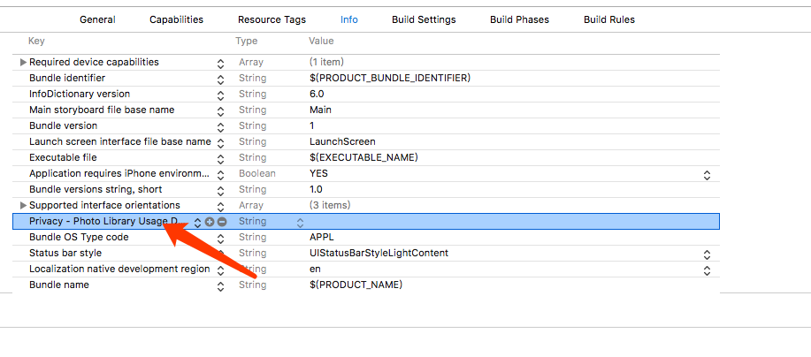
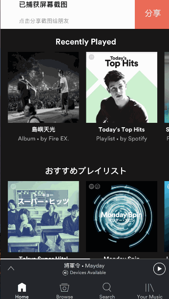

# TCScreenShotTools

[](https://travis-ci.org/itanchao/TCScreenShotTools)
[](http://cocoapods.org/pods/TCScreenShotTools)
[](http://cocoapods.org/pods/TCScreenShotTools)
[](http://cocoapods.org/pods/TCScreenShotTools)

## Example

To run the example project, clone the repo, and run `pod install` from the Example directory first.

## Requirements

## Installation

TCScreenShotTools is available through [CocoaPods](http://cocoapods.org). To install
it, simply add the following line to your Podfile:

```ruby
pod "TCScreenShotTools"
```

## Setting



## Using


```swift
 import TCScreenShotTools
class AppDelegate{
  func shareView(_ shareView: TrickyShareView, didClickShareBtn withShareType: TrickyShareType, withIcon: UIImage) {
        print(withShareType)
    }
    func application(_ application: UIApplication, didFinishLaunchingWithOptions launchOptions: [UIApplicationLaunchOptionsKey: Any]?) -> Bool {
        TCScreenShotTools.shared.enable = true
        TCScreenShotTools.shared.handle = shareView(_:didClickShareBtn:withIcon:)
        return true
    }
}

```





## Author

itanchao, itanchao@gmail.com

## License

TCScreenShotTools is available under the MIT license. See the LICENSE file for more info.
